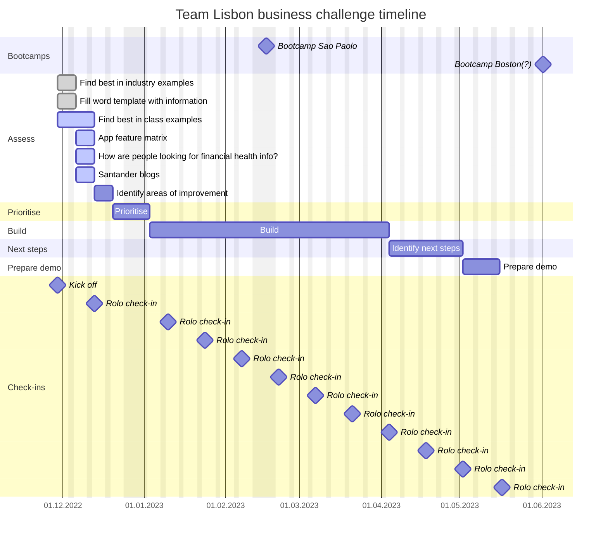

```mermaid
gantt
    title Team Lisbon business challenge timeline
    dateFormat  YYYY-MM-DD
    excludes 2022-12-26, 2022-12-27, 2022-12-28, 2022-12-29, 2022-12-30, 2023-02-13, 2023-02-14, 2023-02-15, 2023-02-16, 2023-02-17, weekends
    axisFormat  %d.%m.%Y
    
    section Bootcamps
    Bootcamp Sao Paolo :milestone, 2023-02-13, 1d
    Bootcamp Boston(?) :milestone, bootcampBoston, 2023-06-01, 1d
    
    section Assess
    Find best in industry examples    :done,industry,after kickoff, 5d
    Fill word template with information    :done,industry,after kickoff, 5d
    Find best in class examples    :active,after kickoff, 10d
    App feature matrix      :active,local,after industry, 5d
    How are people looking for financial health info?      :active,local,after industry, 5d
    Santander blogs      :active,local,after industry, 5d
    Identify areas of improvement :longestAssess,after local, 5d
    
    section Prioritise
    Prioritise :longestPrio,after longestAssess, 5d
    
    section Build
    Build :longestBuild, after longestPrio, 60d
    
    section Next steps
    Identify next steps :longestNext, after longestBuild, 20d
    
    section Prepare demo
    Prepare demo :longestDemo, after longestNext, 10d
    
    
    section Check-ins
    Kick off        :milestone,kickoff, 2022-11-29, 0d
    Rolo check-in :milestone, 2022-12-13, 0d
    Rolo check-in :milestone, 2023-01-10, 0d
    Rolo check-in :milestone, 2023-01-24, 0d
    Rolo check-in :milestone, 2023-02-07, 0d
    Rolo check-in :milestone, 2023-02-21, 0d
    Rolo check-in :milestone, 2023-03-07, 0d
    Rolo check-in :milestone, 2023-03-21, 0d
    Rolo check-in :milestone, 2023-04-04, 0d
    Rolo check-in :milestone, 2023-04-18, 0d
    Rolo check-in :milestone, 2023-05-02, 0d
    Rolo check-in :milestone, 2023-05-17, 0d
```
